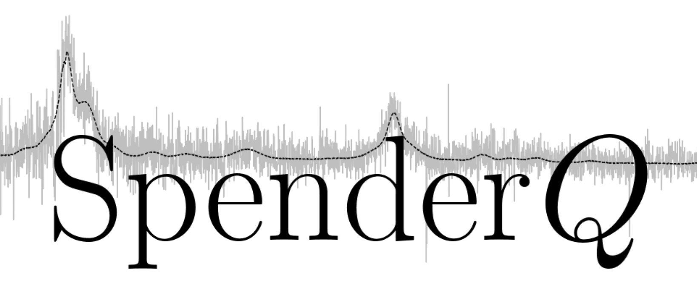
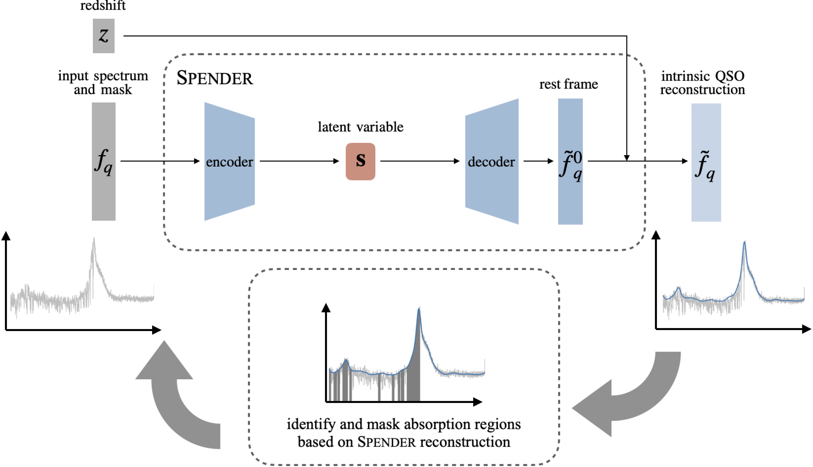
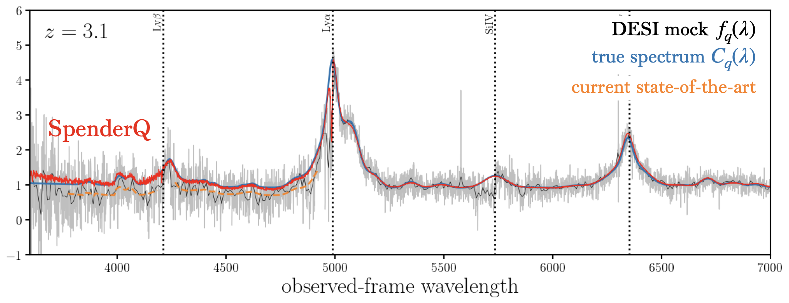
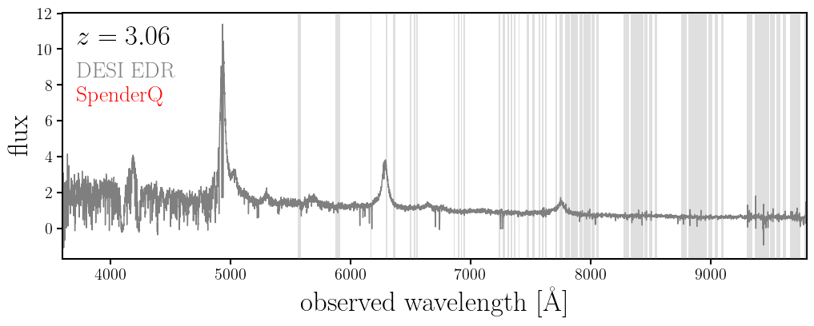
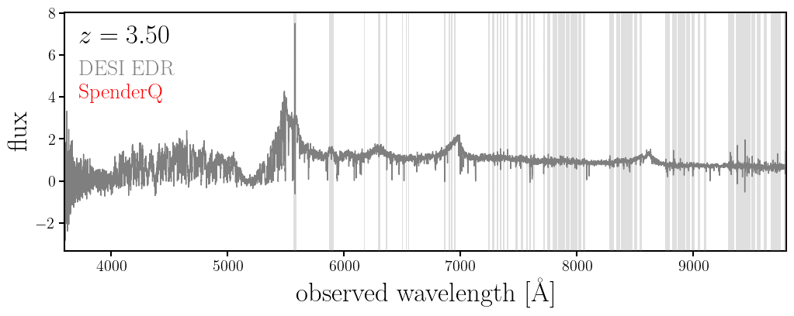

Spectrum autoencoder framework for reconstructing quasar spectra and measuring the Ly$\alpha$ forest. 
 
 

Quasar spectra carry the imprint of foreground intergalactic medium (IGM) through absorption systems. In particular, absorption caused by neutral hydrogen gas, the "Ly$\alpha$ forest," is a key spectroscopic tracer for cosmological analyses used to measure cosmic expansion and test physics beyond the standard model. `SpenderQ` is a ML-based  framework for reconstructing intrinsic quasar spectra and measuring the Lyα forest from observations. `SpenderQ` uses the [`Spender` spectrum autoencoder](https://github.com/pmelchior/spender) to learn a compact and redshift-invariant latent encoding of quasar spectra, combined with an iterative procedure to identify and mask absorption regions. It is entirely data-driven (e.g., not calibrated on simulations) and makes no assumptions on the shape of the intrinsic quasar continuum. 

Here's a schematic diagram of the `SpenderQ` framework:

and an example on a mock spectrum (grey/black) where we know the truth (blue): 

Here's `SpenderQ` in action on real public DESI data: 

Here's another for a spectrum with a Broad Absoprtion Line, which was not
masked

## Team 

ChangHoon Hahn (Princeton; changhoon.hahn[at]princeton.edu)

Satya Gontcho A Gontcho (Berkeley)

Peter Melchior (Princeton)

Abby Bault (Princeton)

Hiram Herrera (CEA)
